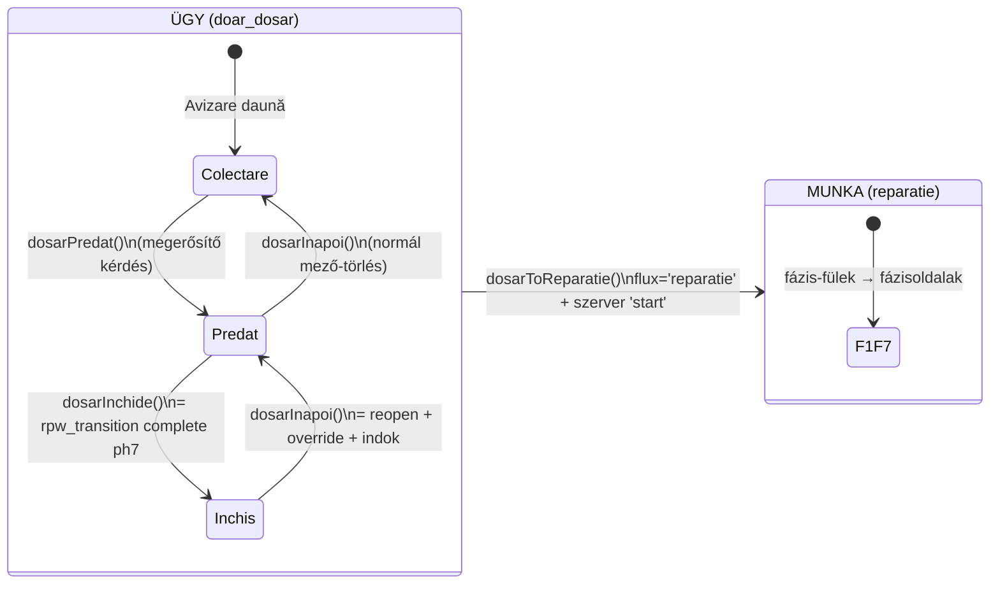

# L2 — Kárügy-adatlap („Red Dosar Auto", `rpw-dosar.html`) teljes vezérlő-térkép

> **Vizsgált forrás:** `docs/architektura-L1` ág (= v2-konszolidáció), `rpw-dosar.html`, 1116 sor.
> **Módszer:** azonos az L1-gyel — csak a tényleges kód számít. Az L1 döntései (K-1..K-8) már
> figyelembe vannak véve; ahol egy döntés új követelményt szül, a CÉL-oszlop jelzi.

## 0. A lap kettős szerepe (a K-1/B döntés tükrében)

Ez a lap a **logikai szétválasztás természetes határvonala**: felül az ÜGY él
(dosszié-életciklus, iratok, határidők), a fázis-fülek mögött a MUNKA. A K-1/B döntés
szerint nem lesz két objektum — de ennek a lapnak a két zónája lesz a két
mezőcsoport (ügy-mezők ↔ munka-mezők) felülete.

Az állapotsáv forrása (340): `_st = inchis ? 3 : (dosarPredat ? 2 : 1)` — a
„Colectare acte → Predat la asigurător → Închis" három lépés, dátumokkal.

## 1. FEJLÉC ÉS ÁLLAPOTSÁV

| vezérlő | hívás (sor) | mit módosít | védelem | audit | minősítés |
|---|---|---|---|---|---|
| ← vissza | `location.assign('index.html')` | — | — | — | működik |
| RO/EN/HU | `sL()` | localStorage | — | — | működik |
| **Predat la asigurător** | `dosarPredat` (594) → megerősítő kérdés → `dosarPredat=ddDay(0)` patch | normál mező | megerősítés van; jog nincs | legacy: nincs | működik |
| **Închide dosarul** | `dosarInchide` (608) → **`rpw_transition complete phase 7`** a workflow-rétegen | `inchis` CSAK szerveren | szerver: `close` jog + követelmények + nyitott rework tilt | secure: igen | működik (secure módban végponti; legacy: lokális út) |
| **Redeschide** | `dosarInapoi` (653): zártnál `reopen` + **kötelező indok (min. 5 kar.) + override jog a szerveren**; nem-zártnál mező-törlés | vegyes | zártnál: szerver | zártnál: igen | működik |
| **Adaugă reparație** | `dosarToReparatie` (679): `flux='reparatie'` patch + szerver `start` az 1. fázisra | flux normál mező; phase a szerveré | megerősítő kérdés | secure: igen | működik — **ez a CASE→WORK átadási pont** (cél: VEHICLE_ARRIVED/WORK_ORDER_ACTIVATED esemény formalizálása) |
| Határidő-sáv | `ddTermene` (725): Predat-tól **3 munkanap** constatare, **30 nap** kártérítési ajánlat (Legea 132/2017); színkód késésre | számított, nem tárolt | — | — | működik |
| Fázis-fülek | `PHASE_PAGES` (318); tiltott fázisnál `rpwPhaseBlocked` okokkal | — | `canEnterPhase` | — | működik |
| Vezetői felülbírálás | `rpwOverride` (528): cél-fázis+actor+indok prompt → `reopen` a szerveren | workflow | **CSAK admin-módban látszik** (385) — de a kód maga is kimondja (296): „a jelenlegi admin mód csak UI-kapu, NEM biztonságos autentikáció"; a valódi jog a szerveren dől el | igen | működik |

## 2. ÜGY-ZÓNA SZEKCIÓK

| szekció | vezérlők | írás | minősítés |
|---|---|---|---|
| Date client / Date vehicul | megjelenítés + `setDosarField` (asigurator, nrDosar 760) | `patchV2` mezőnként | működik; **kárszám/biztosító íráskor `dosarDupCheck` (787) figyelmeztet duplikátumra** — nem blokkol, linkel a másikra |
| Statusul dosarului | `setDosarStatus` deschid/deschis (752) — csak javítási munkán látszik; doar_dosar-nál fix 'deschid' | `patchV2` | működik |
| Acte dosar daună (0/17) | `uploadActa` (838, tömörítés 1400px/0.72), `delActa`→megerősítés→`_stergeActaGo`, `openLB` nagyítás, **bulk: `bulkActe`→AI-javaslat (`RPWClassify.plan`)→emberi jóváhagyás→`bulkConfirm`** | storage-fájl + `dosarActe` patch | működik; az AI-út él, de a szerveroldali classify kulcs nélkül (G-05) a javaslat üres marad — a kézi besorolás ettől még megy |
| Trimite link клиent | `trimiteLinkUpload` (560): wa.me-üzenet a `rpw-upload.html?job=ID` linkkel | — | **részben működik / KOCKÁZAT**: a link VÉDTELEN — nincs token, nincs lejárat, nincs visszavonás; maga a fájl (12. sor) mondja ki, hogy „külön feltöltő-token oldja meg véglegesen". A job-ID ismeretében bárki feltölthet. (G-06 megerősítve kóddal) |
| Descarcă dosar (ZIP) | `exportDosar` (1026): hiánylista-ellenőrzés → megerősítés → `exportDosarZip` **böngésző-letöltés** | — | működik, DE a **K-6 döntés szerint a cél: a ZIP a SAJÁT STORAGE-ba is mentődjön** és az ügy ettől váljon „Separat"-tá — ez ma NINCS: a kódban egyetlen storage-írás sincs az export útján |
| Talon/Documente/Fotografii/Evaluare | csak MEGJELENÍTÉS + nagyítás; feltölteni a fázisoldalakon lehet | — | működik (szándékos csak-olvasás) |

## 3. FELTÁRT ELLENTMONDÁSOK (L2)

| # | ellentmondás | hol | kockázat |
|---|---|---|---|
| **E-9** | A „Separat" fülnek (K-6: lezárt+egy-fájlba-archivált ügyek) ma SEMMI köze az exporthoz: a `separat` flag kézi pipa a szerkesztőben, az export pedig csak letölt. A kettő között nincs kapcsolat | index.html 1100 ↔ rpw-dosar.html 1026 | a „lezárt és archivált" állapot nem bizonyítékon (storage-fájl) áll, hanem kézi jelölésen |
| **E-10** | Az ügyfél-feltöltő link védtelen (nincs token/lejárat/limit) — és ezt a kód kommentje is tudja | rpw-dosar.html 560, rpw-upload.html 12 | bárki, aki a linket látja, idegen ügybe tölthet fel; GDPR-kockázat |
| **E-11** | A „Predat la asigurător" (a 3/30 napos törvényi határidők startpontja!) normál mező, jog és audit nélkül átállítható/törölhető (`dosarInapoi` nem-zárt ágon) | 594, 653 | a határidő-számítás alapja manipulálható nyom nélkül |
| **E-12** | Az ügy lezárása (`dosarInchide`) a 7. FÁZIS lezárása — de a doar_dosar ügynek NINCSENEK fázisai (a lap maga mondja: „nincs javítási cső"). A szerveroldali phase-7 követelmények (számla, deviz, 5 záró fotó…) egy iratgyűjtő ügyre értelmetlenek, secure módban VÉLETLENÜL blokkolnák a dosszié-lezárást | 337 komment ↔ 006 checkPhase7 | a cutover után a kárügy-lezárás elakadna — a doar_dosar-nak SAJÁT lezárási szabály kell |
| **E-13** | `dosarToReparatie` két külön írás (flux-patch + start-transition) — a kettő között megszakadva az ügy „javítás fázis nélkül" állapotban ragadhat | 684 | fél-átment állapot; a CASE→WORK átadás nem atomi |

## 4. TULAJDONOSI KÉRDÉSEK (L2 után)

**K-9 · Mi legyen a doar_dosar ügy lezárási feltétele?** (E-12)
A javítási munka phase-7 szabályai (számla, deviz, záró fotók) kárügyre nem illenek.
Javaslat: a doar_dosar lezárása = minden kötelező irat megvan (17/17 vagy indokolt hiány)
+ dosarPredat kitöltve. — *Jó így, vagy más a feltétel?*

**K-10 · A „Predat la asigurător" védelme** (E-11)
Ez indítja a törvényi határidőket. Legyen-e: (A) csak megerősítéssel + audittal
állítható, visszavonása indokhoz kötve; vagy (B) marad szabad mező?

**K-11 · Az ügyfél-link (E-10) — melyik szint kell?**
(A) teljes: egyszer használatos token + lejárat + visszavonás + fájllimit (a spec 20. pontja);
(B) minimum: lejáró link + fájltípus/méret-limit. — *A kártyás ügymenethez az (A) az ajánlott.*

**K-12 · A K-6 archívum pontosítása:** a lezárt ügy ZIP-je MIKOR készüljön a storage-ba —
(A) a „Închide dosarul" pillanatában automatikusan, és a siker tegye az ügyet „Separat"-tá;
vagy (B) külön „Arhivează" gombbal, kézzel?
