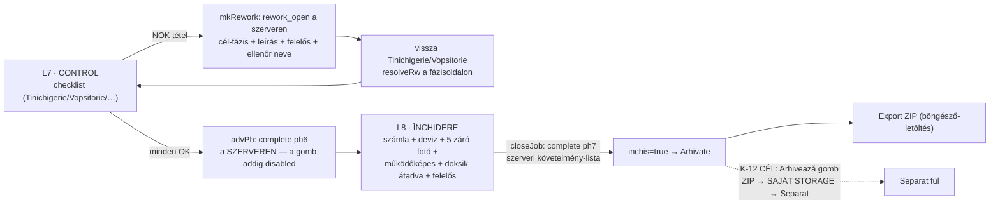

# L7–L8 — Minőség-ellenőrzés (Control) és Lezárás/Átadás (Închidere) — vezérlő-térkép

> **Vizsgált forrás:** `rpw-control-red.html` (~400 sor), `rpw-inchidere-red.html` (~1000 sor).

## 0. A lánc vége a kódban

## 1. L7 · CONTROL

| vezérlő | kód | viselkedés | minősítés |
|---|---|---|---|
| Checklist | `CHECKLIST` (161): Tinichigerie 5 pont, Vopsitorie, … kategóriánként; `setChk` ok/nok, `setChkNote` megjegyzés | `controlChecks{}` | működik |
| Nyitott reworkok listája | `RPWWorkflow.openReworks` (302) | láthatóak a lapon, forrás-fázissal és felelőssel | működik |
| **NOK → Rework** | `mkRework` (344): leírás + felelős + **ellenőr neve PROMPT-ból** → `rework_open` a SZERVEREN, cél-fázissal; `control.lastResult='nok'` | a rework-rekord: id, kategória, cél-fázis, leírás, assignedTo, createdBy, seed | működik — de az ellenőr neve gépelt (E-23 minta; K-20 döntés ide is vonatkozik) |
| **Avansează** | `advPh` (365): a gomb **disabled**, amíg a checklist nem teljes és nincs nyitott rework (`canCompletePhase(6)`); complete a szerveren | valódi-katt teszttel igazolt (a teszt kényszerítette ki a kitöltést!) | **működik** |
| Nyomtatás | `window.print` | — | működik |

A spec 17. pontjának rework-mezői közül **megvan**: azonosító, forrás/cél-fázis, hiba-leírás,
felelős, nyitó személy+idő, lezáró személy+idő (resolveRw), státusz. **Hiányzik**: határidő,
ok-kategória finomabb bontása, ellenőrzési eredmény külön mezőben.

## 2. L8 · ÎNCHIDERE

| vezérlő | kód | viselkedés | minősítés |
|---|---|---|---|
| Záró mezők | `uCl` (534): factura, deviz (ref/típus/fájl `addDevizFile`), asigurator, megjegyzés | `closing{}` | működik |
| 5 záró fotó | `addPh/delClosePhoto` | `closingPhotos[]`; törlés megerősítéssel | működik |
| Kapcsolók | vehicleOperational · finalControlConfirmed · documentsDeliveredToOffice · **handoverBy (átadás felelőse)** | `closing.*` | működik — a handoverBy itt is gépelt név (K-20 vonatkozik) |
| **Închide lucrarea** | `closeJob` (552): `complete phase 7` a szerveren — a `checkPhase7` a TELJES csomagot követeli (számla, deviz v. devizNotRequired, 5 VALÓDI fotó, működőképes, végkontroll, doksik, felelős, nincs nyitott rework, ph6 done) | gomb disabled amíg hiányos | **működik** — valódi-katt teszttel igazolt |
| Lezárás után | a mezők `disabled` (4 helyen) — zárt munkán nem szerkeszthető; újranyitás CSAK a dosszié-lap `Redeschide` útján (override+indok) | | működik — helyes egyirányúság |
| **Export ZIP** | `openExport` szelektor (talon/buletin/…/dataHTML) → `doExportZip` (661): **`a.download` böngésző-letöltés (958)** | | működik MINT LETÖLTÉS — **a K-12 „Arhivează a saját storage-ba" itt NINCS: egyetlen storage-írás sincs az export útján** (E-9 megerősítve az L8-on is) |

## 3. ELLENTMONDÁSOK (L7–L8)

| # | ellentmondás | hol | kockázat |
|---|---|---|---|
| **E-26** | Az ellenőr és az átadási felelős neve prompt-ból gépelt (mkRework `ctrlNamePrompt`, closing `handoverBy`) — ugyanaz a hitelesség-rés, mint E-23, a lánc legkritikusabb két pontján | control 348, inchidere 303 | a minőség-döntés és az átadás nem köthető hitelesen személyhez |
| **E-27** | A K-12 döntés („Arhivează" → ZIP a saját storage-ba → Separat) SEMMILYEN formában nincs a kódban: az export letöltés, a Separat kézi pipa, kapcsolat nincs | inchidere 958, index 1100 | a lezárt ügy bizonyíték-csomagja csak a felhasználó gépén létezik |
| **E-28** | A rework-nak nincs határideje — a spec 17. pontja kéri; a nyitott rework blokkolja a lezárást (jó), de senki nem látja, MEDDIG kellene kész lennie | rework-rekord mezői | a visszajavítás lóghat a levegőben; az azi-modal nem tudja jelezni |

## 4. TULAJDONOSI KÉRDÉSEK (L7–L8 után)

**K-24 · Rework-határidő (E-28):** kapjon-e a rework kötelező határidőt nyitáskor,
és a lejárt rework jelenjen-e meg a „Ce facem azi?" RST-szekciójában?

**K-25 · Export-tartalom:** az Arhivează-ZIP (K-12) tartalma egyezzen-e a mai
export-szelektorral (talon/buletin/constatare/fotók/adatlap), vagy legyen FIX,
teljes csomag (mindig minden) — hogy az archívum egységes legyen?
