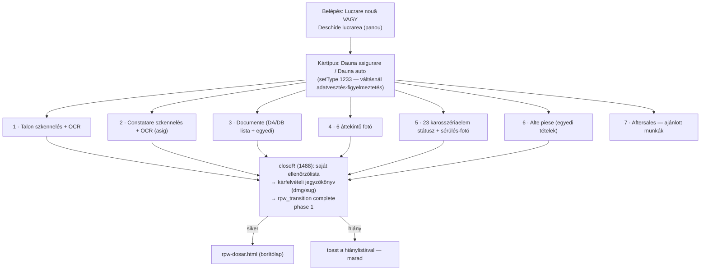

# L4 — Járműátvétel („Recepție", `rpw-recepcio-red.html`) — teljes vezérlő-térkép

> **Vizsgált forrás:** `rpw-recepcio-red.html`, 1566 sor. Ez a munkavégzési rendszer
> (B) első fázisa — a spec „Jármű átvétele + átvételi állapotfelmérés + munkalap
> aktiválása" lépéseinek EGYBEN felel meg.

## 0. A lap folyamata

## 1. FŐ VEZÉRLŐK

| vezérlő | kód | mit ír | védelem | minősítés |
|---|---|---|---|---|
| Kártípus-választó | `setType` (1233) | `damageType`; ha már van adat, MEGERŐSÍTÉST kér a váltáshoz | megerősítés | működik |
| Talon feltöltés | `upTalon` (1245) → `uploadPhoto`: **privát Storage** (`JOB.id/talon.jpg`, upsert, aláírt URL) → `ocrTalon` | fájl + `photoKeys/photoUrls` + OCR-mezők | — | működik; OCR élesben kulcs nélkül néma (G-05) |
| OCR-felülírási szabály | `_plateEdited/_vinEdited…` flagek | **az OCR CSAK a kézzel nem szerkesztett mezőt írja felül** — az ember szava az erősebb | jó minta | működik |
| Buletin / Constatare / Documente | `upBuletin/upConstatare/upDoc/upCustomDoc` (+törlés) | mint fent; kötelezőség a DA/DB listából | — | működik |
| 6 áttekintő fotó | `upOv` (1346) | `ov_0..ov_5` | — | működik |
| 23 elem térkép | `mE/sEN/sEW/sEOp/aEP/dElPh` | `elements[k]`: státusz (ok/avariata/recomandata), munkanem, normaóra, elem-fotó | sérült/ajánlott elemhez fotó-kényszer a closeR-ben | működik |
| Alte piese / Aftersales | `addAltPart/updAlt/aAltP/sEAlt` | `alteParti[]` | mint fent | működik |
| **Închide recepția** | `closeR` (1488): saját teljes ellenőrzőlista (talon, constatare/kárszám-szabály, kötelező doksik, 6 fotó, MIND a 23 elem, sérült-fotók) → kárfelvételi jegyzőkönyv (`dmg/sug`, normaóra-összeg) → **`rpw_transition complete phase 1`** → dosszié-lap | workflow-mezők CSAK a szerveren | szerver + saját lista | **működik** — valódi-kattintás teszttel igazolt (test-fe-click.js) |
| Fázis-fülek / vissza | `goPhase`, shell | navigáció; `installPageGuard({phase:1})` fázis-őr | canEnterPhase | működik |

## 2. MENTÉSI ÚT

Minden mezőmódosítás `saveJ()` → **`SAVER` (rpw-save.js, tartós offline sor)** —
ez az EGYETLEN fázisoldal, amely már a sor-alapú mentőn fut (227–230), kilépés-őrrel
(„Există modificări nesincronizate"). A többi oldal debounce-olt `RPWDb.patch`-en megy.

## 3. ELLENTMONDÁSOK (L4)

| # | ellentmondás | hol | kockázat |
|---|---|---|---|
| **E-18** | A recepció-lap kárügyre (doar_dosar) is megnyitható URL-ből — a lapon SEMMI nem ellenőrzi a fluxot; egy iratgyűjtő ügyön el lehet indítani a teljes átvételt | nincs doar_dosar-ág a fájlban (grep: 0 találat) | ügy és munka összemosódik — pont amit a K-1 határ tiltana |
| **E-19** | `window.mark(flag){JOB[flag]=true}` — TETSZŐLEGES mezőnév true-ra állítható a felületről; generikus hátsó kapu (workflow-mezőt secure módban a szerver úgyis elutasít, de normál mezőt bármit átír) | 1231 | fegyelmezetlen írási út; a K-1/B mezőcsoport-védelem megkerülhető lenne |
| **E-20** | A closeR ellenőrzőlistája és a szerveroldali `rpw__missing` KÉT külön szabálylista — ma tartalmilag közel azonosak, de semmi nem őrzi, hogy együtt mozogjanak (a kliens szigorúbb: mind a 23 elem; a szerver: elementsComplete) | 1488 ↔ rpw-workflow 274 | szabály-szétcsúszás veszélye: a kliens átenged, a szerver elutasít — vagy fordítva |
| **E-21** | Az átvételkor NINCS „ki vette át" rögzítés: a `completePhase(actor:'receptie')` fix szöveg, nem a bejelentkezett dolgozó | 1551 | a spec L4 követelménye (felelős személy) nem teljesül; secure módban a szerver a tokenből úgyis tudja — legacy módban senki |

## 4. TULAJDONOSI KÉRDÉSEK (L4 után)

**K-17 · Kárügy a recepción (E-18):** a doar_dosar ügyet a recepció-lap
(A) utasítsa el („előbb Adaugă reparație a dosszié-lapon"), vagy (B) ajánlja fel
ott helyben az átalakítást? — *Az (A) a tisztább határ, a (B) a gyorsabb pult.*

**K-18 · Átvételi felelős (E-21):** elég-e, hogy a cutover után a szerver a
tokenből rögzíti, KI zárta a recepciót — vagy addig is jelenjen meg a lapon egy
„Átvette: <bejelentkezett név>" mező?
