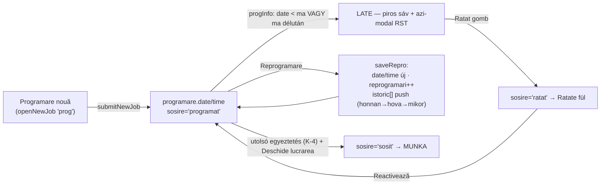

# L3 — Időpontfoglalás és átütemezés — teljes vezérlő-térkép

> **Vizsgált forrás:** `index.html` — a Programare nouă űrlap (1567–2010) és a
> Reprogramare modal (1673–1723), valamint a késés-számítás (`progInfo`).
> Az L1 sor-műveleteinél már érintett részeket itt mélységében dolgozom fel.

## 0. Az időpont életútja

## 1. PROGRAMARE NOUĂ űrlap (részletek, az L1 1.2-n túl)

| elem | kód | viselkedés | minősítés |
|---|---|---|---|
| Rendszám | `njOkPlate` | **kötelező minta: `XX-99(9)-XXX`** — külföldi/egyedi rendszám NEM vihető fel | működik, de lásd E-14 |
| Telefon | `njOkPhone` | `+40/0` + 9 számjegy — külföldi szám nem | működik, lásd E-14 |
| Dátum-gyorsgombok | ma/holnap/holnapután/+7 + szabad naptár | **múltbeli dátum is választható** — semmi nem tiltja | lásd E-15 |
| Ütközés | — | **NINCS kapacitás/idősáv-ellenőrzés**: ugyanarra a napra/órára korlátlan előjegyzés vihető fel; a Parametri-oldal számol kapacitást, de az előjegyzés nem kérdezi | lásd E-16 |
| Duplikátum | `njDup` (1877) | eset-azonosság blokkol; más eset ugyanarra az autóra tájékoztat | működik |

## 2. REPROGRAMARE modal

| kérdés | válasz (kóddal) |
|---|---|
| Indítás | sor-gomb / azi-modal RST-akció (`openRepro` 1673) |
| Mit mutat | előző időpont + eddigi átütemezések száma |
| Validáció | csak „van-e dátum" (`repro_need`) — múltbeli dátum, indok, limit NINCS |
| Mit ír | `programare.date/time`; `reprogramari++`; `istoric[]` push `{din,catre,la}`; `sosire='programat'` (ratat-ból is visszahoz) — az `inchis`-hez NEM nyúl (helyes) |
| Mentés | `saveJob` → legacy: teljes-job patch, jog/audit nélkül; secure: v3 |
| Audit | az `istoric[]` jó ELŐZMÉNY, de nem audit: nincs benne KI — csak mikor és mire | 
| Minősítés | **működik**; hiányok: E-17 |

## 3. KÉSÉS-FELISMERÉS (`progInfo` 1640)

- `date < ma` → **late** (+napok száma); `date = ma és délután van` (`PG_DELUTAN` óra után) → **late**;
- a Viitoare fül tetején piros sáv a késettek számával; az azi-modal RST-szekciója soronként ad „Reprogramare" akciót;
- **a Ratat gombnak viszont SEMMI köze ehhez**: bármely jövőbeli előjegyzésen is megnyomható (L1/E-3) — a K-3 döntésed („ratat = nem jött, késik") a kódban nincs kikényszerítve.

## 4. ELLENTMONDÁSOK (L3)

| # | ellentmondás | hol | kockázat |
|---|---|---|---|
| **E-14** | A rendszám- és telefonminta kizárja a külföldi ügyfelet (`XX-99-XXX`, `+40/0…`) — egy német rendszámú autó fel sem vihető | njOkPlate/njOkPhone 1770 | elveszett ügyfél a pultnál; kézi trükközés (hamis adat) kényszere |
| **E-15** | Múltbeli dátumra is lehet előjegyezni (új űrlapon és átütemezésnél is) — az így felvett munka AZONNAL „késett" | nj/repro dátummezők | szennyezett késés-lista, hamis riasztás |
| **E-16** | Nincs semmilyen kapacitás-ellenőrzés előjegyzéskor; a Parametri-oldal kapacitás-számítása és az előjegyzés nem beszél egymással | 1567 ↔ renderParametri | túlvállalás; a spec „időpont-egyeztetés" folyamata fél lábon áll |
| **E-17** | Az átütemezés-előzmény (`istoric`) nem rögzíti, KI ütemezett át, és nincs átütemezési limit/indok — a `reprogramari` számláló nő, de következménye nincs | 1714 | sorozat-átütemezés észrevétlen marad (a K-8 döntésed pont ezt akarja láthatóvá tenni) |

## 5. TULAJDONOSI KÉRDÉSEK (L3 után)

**K-13 · Külföldi rendszám/telefon (E-14):** engedjük-e? (A) laza minta + „külföldi"
jelölő; (B) marad a szigorú román minta. — *A kártyás forgalomhoz az (A) tűnik életszerűnek.*

**K-14 · Múltbeli dátum (E-15):** (A) tiltjuk (a ma az első választható nap);
(B) engedjük, mert utólagos rögzítésre használjátok. — *Melyik a valóság nálatok?*

**K-15 · Kapacitás (E-16):** kell-e az előjegyzésnél napi darabszám-korlát
(pl. figyelmeztetés: „erre a napra már N autó van előjegyezve")? Ha igen: honnan
jöjjön a szám — a Parametri-oldal kapacitás-értékéből?

**K-16 · Átütemezési szabály (E-17):** hányadik átütemezés után jelezzen a
rendszer (azi-modal, K-8), és kelljen-e indok a 2.-3. átütemezéstől?
