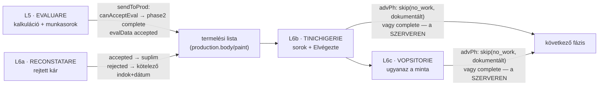

# L5–L6 — Munkalap (Evaluare) és munkafázisok (Reconstatare · Tinichigerie · Vopsitorie) — vezérlő-térkép

> **Vizsgált forrás:** `rpw-evaluare-red.html` (1139 sor), `rpw-reconstatare-red.html`,
> `rpw-tinichigerie-red.html`, `rpw-vopsitorie-red.html`. A Control (L7) és az
> Închidere (L8) külön dokumentumban következik.

## 0. A termelési lánc a kódban

## 1. L5 · EVALUARE (a spec „Munkalap"-ja)

| vezérlő | kód | viselkedés | minősítés |
|---|---|---|---|
| Audatex import | `importAudatex` (554): fájl → OCR → órák/árak/kárszám a `JOB.audatex`-be | **nincs validáció az OCR-számokon** (num() csak parszol); törlés (`delAudatex`) szabad, nyom nélkül | részben — élesben OCR-kulcs nélkül halott (G-05); validáció-hiány: E-22 |
| Munkasorok (comanda) | `addRow/upRowOp/upRowHrs/upRow` | op + óra soronként; tarif-kezelés (`toggleTarif/upTarif`) | működik |
| Alkatrészek | `addPiesa/upPiesa/delPiesa` | `piese[]` lista | működik — de a spec „felhasznált anyag/alkatrész fázisonként" igénye (raktárkapcsolat) nincs |
| Határidő | `upTermen` | `termenPredare` | működik |
| Státusz-gombok | `setEvalSt` (937): Ciornă/Trimis/**Acceptat** — az Acceptat KÉZZEL is beállítható, de CSAK ha `canAcceptEval` átengedi | a kapu megvan | működik |
| **Trimite în producție** | `sendToProd`→`_finishEval` (946): `canAcceptEval` (van jóváhagyott sor op+órával + határidő) → `evalData.status='accepted'` + **phase2 complete a szerveren** | valódi-katt teszttel igazolt | **működik** |
| WhatsApp/mail/print | `sendWA/sendMail/printDoc` | értesítés-küldés | sendMail: szerverless kulcs nélkül halott; WA: linknyitás (K-4 döntés vonatkozik rá) |

## 2. L6 · TERMELŐ OLDALAK (közös minta)

| elem | kód | viselkedés | minősítés |
|---|---|---|---|
| Sor-lista | `bodyRows/paintRows`; forrás-jelölés (`src`: evaluare/manual/reconstatare/aftersales) | reconstatare- és aftersales-sor CSAK jóváhagyás után (`toggleAppr`) kerül termelésbe (`syncProduction` 447) | működik — a spec „jóváhagyó személy" mezője nélkül (csak flag) |
| **Elvégezte** | `setDone` (434): prompt a névre; **placeholder-nevet elutasít** (`isRealPerson`: 'lakatos','test','xxx'…); `completedBy/completedAt` | a név GÉPELT, nem a bejelentkezett dolgozó (E-21 minta) | működik |
| Rework-feloldás | `resolveRw` (417) | a fázis-oldalon zárható a rá kiosztott rework | működik |
| **Fázis-zárás** | `advPh` (460): üres műhely → **dokumentált SKIP** (`no_bodywork` indokkal), különben complete — mindkettő a szerveri átmeneten | valódi-katt teszt fedi | **működik** |
| WhatsApp-összefoglaló | `waBody/waPaint` | műszakvégi üzenet | működik (linknyitás) |

## 3. L6a · RECONSTATARE (rejtett kár — a spec 5–6. lépése)

- Rejtett kár rögzítése sorokként + **bizonyíték-fotók** (törlés dupla megerősítéssel: „a fotó DOVADĂ");
- `rcResponse` (399): a biztosítói válasz **accepted** → a sorok pótmunkává válnak (`reconstToSuplim`), **rejected** → **kötelező válasz-megjegyzés és dátum**;
- a biztosító felé küldés MANUÁLIS (nincs kommunikációs esemény — G-07);
- Minősítés: **működik** — ez a spec HIDDEN_DAMAGE_FOUND → SUPPLEMENT_APPROVED átadásának kliens-oldali megfelelője, formális esemény-objektum nélkül.

## 4. AMI A SPEC 4. PONTJÁBÓL HIÁNYZIK (fázisonként)

| spec-követelmény | állapot a kódban |
|---|---|
| felelős személy/csapat | csak gépelt név a sorokon; fázis-szinten fix actor-szöveg (E-21) |
| munkaállomás | a `rpw-cos.html` (posturi) külön él, a fázis-oldalak NEM rögzítik, melyik poszton folyt a munka |
| tervezett kezdés/befejezés | NINCS — csak `termenPredare` (végdátum) van; fázis-szintű terv nincs |
| tényleges kezdés/befejezés | szerveri átmenetnél `started/finished` (006); soronként `completedAt` — megvan |
| felhasznált anyagok | `piese[]` az evaluarén; fázisonkénti anyag-rögzítés NINCS |
| minőségi elfogadási feltétel | a Control-oldal checklistje (L7) — fázisonként külön nincs |

## 5. ELLENTMONDÁSOK (L5–L6)

| # | ellentmondás | hol | kockázat |
|---|---|---|---|
| **E-22** | Az Audatex-import OCR-számai ellenőrzés nélkül landolnak a kalkulációban (órák, árak, végösszeg), és szabadon törölhetők/felülírhatók nyom nélkül | evaluare 554 | hibás OCR → hibás árajánlat; a G-10 (nincs teszt) ezt erősíti |
| **E-23** | Az „Elvégezte" azonosság gépelt szöveg — két dolgozó azonos névvel, elgépelés, más nevében pipálás lehetséges; a bejelentkezett munkamenet (RPWAuth.name) RENDELKEZÉSRE ÁLLNA, de a lapok nem használják | setDone (mindhárom oldal) | a teljesítmény-elszámolás (norma-óra!) hamisítható |
| **E-24** | A reconstatare→pótmunka jóváhagyás egy toggle (`toggleAppr`), jóváhagyó személy és időpont nélkül; a spec SUPPLEMENT_APPROVED eseménye (ki, mikor, mit hagyott jóvá) nem rekonstruálható | tinichigerie 352 | vitás biztosítói ügynél nincs bizonyíték a jóváhagyásról |
| **E-25** | Fázis-szintű terv (tervezett kezdés/befejezés, munkaállomás) nincs — a Gantt/kapacitás-tervezés (K-15 döntésed!) adata a termelésből hiányzik | mind a 3 oldal | a kapacitás-figyelmeztetés csak az előjegyzés-darabszámra tud épülni, a valós terhelésre nem |

## 6. TULAJDONOSI KÉRDÉSEK (L5–L6 után)

**K-20 · Elvégezte-azonosság (E-23):** a sorok „Elvégezte" mezője a BEJELENTKEZETT
dolgozó legyen-e (egy kattintás, nincs gépelés), a gépelt név pedig csak kivétel
(pl. bejelentkezés nélküli műhelygép esetén)?

**K-21 · Pótmunka-jóváhagyás (E-24):** a reconstatare/aftersales termelésbe engedése
rögzítse-e (ki + mikor + megerősítés)? — *A biztosítós vitákhoz ajánlott.*

**K-22 · Audatex-védelem (E-22):** kell-e ésszerűség-ellenőrzés az importált számokra
(pl. óra > 0 és < 200, összeg-egyezés), és megerősítés a felülírás előtt?

**K-23 · Fázis-terv (E-25):** kell-e fázisonként tervezett kezdés/befejezés és
munkaállomás-hozzárendelés (a rpw-cos posturi összekötése a fázisokkal), hogy a
kapacitás-kép valós legyen? Ez nagyobb munka — őszintén jelzem.
